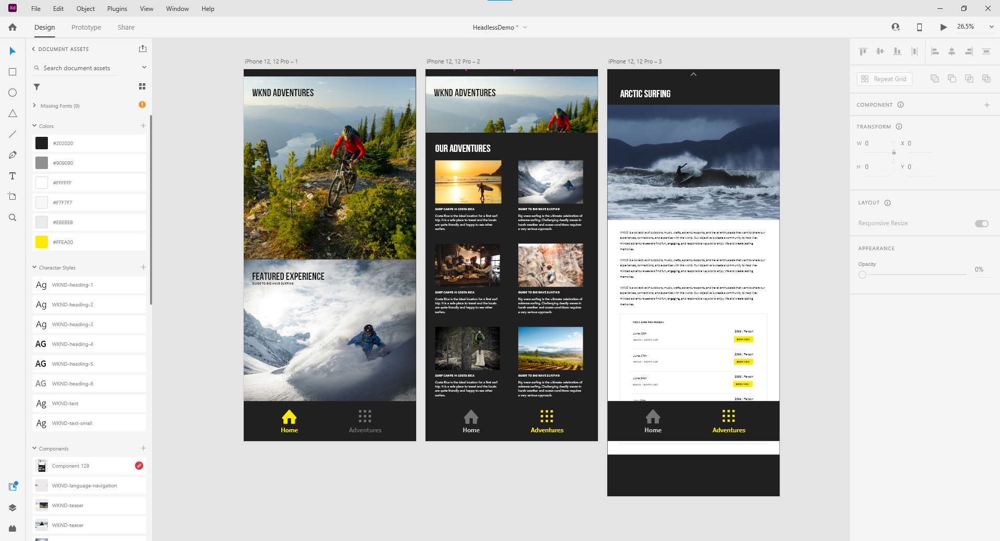

# WKND Native App

## UI Design




## GraphQL Queries

### Screen 1

The home screen consists of a single GraphQL query that searches across two Content Fragment Models:

1. App model
2. Adventure model

```
  {
    appByPath (_path: "/content/dam/wknd/en/app/wknd-adventures") {
      item {
        _path
        appTitle
        appHeroImage {
          ... on ImageRef {
            _path
            width
            height
          }
        }
      }
    }
  }
```

### Screen 2 - Adventure List

```
  {
    adventureList {
      items {
        _path
        adventureTitle
        adventureDescription {
          html
        }
        adventurePrimaryImage {
          ... on ImageRef {
            _path
            width
            height
          }
        }
      }
    }
  }
```

TODO:
* [] Page title: WKND Adventures
* [] Hero image
* [] Sub heading: Our Adventures

### Screen 3

```
  {
    adventureList {
      items {
        _path
        adventureTitle
        adventureDescription {
          html
        }
        adventurePrimaryImage {
          ... on ImageRef {
            _path
            width
            height
          }
        }
      }
    }
  }
```

TODO:
* [] Event List
  * [] Event

## Persisted Queries

### Screen 1

TODO

### Screen 2 - Adventure List

An out of the box PQ is included that contains some of the required page data. 

```
$ curl -u admin:admin http://localhost:4502/graphql/execute.json/wknd/adventures-all
```

The following fields are missing:

1. Page title: WKND Adventures
2. Hero image
3. Sub heading: Our Adventures
4. Adventure description

To help close the gaps the following PQ is used.

```
TODO
```

### Screen 3 - Adventure Title

TODO
